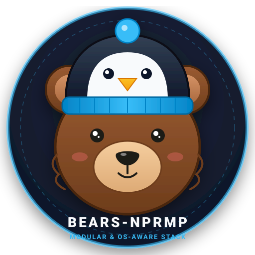

<div align="center">
  
  <h1>🐻 BearsNPRMP</h1>
  <p><strong>Universal OS-Aware &amp; Modular Web Development Stack</strong></p>
  <p>Inspirado en BearSAMPP pero diseñado para <strong>Linux Universal</strong> (Debian, Ubuntu, Fedora, RHEL, Arch, openSUSE, Alpine) y <strong>WSL2</strong>.</p>

  <p>
    
    
    
    
    
    
    
    
    
    
  </p>
</div>

---

## 🌟 ¿Qué es BearsNPRMP?

**BearsNPRMP** es un entorno de desarrollo web completo, modular y resiliente. A diferencia de stacks acoplados a una sola distribución, BearsNPRMP incluye un motor de detección que identifica automáticamente tu sistema operativo, gestor de paquetes y entorno de ejecución (**WSL2**, **Bare-metal** o **Máquina Virtual**), desplegando una infraestructura de desarrollo web libre de conflictos de puertos y lista para producción local.

---

## ✨ Características Principales

* 🐧 **S.O. &amp; Environment Aware**:
  * **Detección de Distro**: Soporte nativo para `apt` (Debian/Ubuntu/Mint), `dnf`/`yum` (Fedora/RHEL/Rocky), `pacman` (Arch/Manjaro), `zypper` (openSUSE) y `apk` (Alpine).
  * **Detección de Entorno**: Configuración inteligente de `/etc/hosts` en Linux nativo y soporte para localhost forwarding en WSL2.
* 📦 **Stack Multi-Versión**:
  * **PHP Multi-Versión**: 7.4 (puerto `9002`), 8.4 (puerto `9001`) y 8.5 (puerto `9000`).
  * **MariaDB Multi-Versión**: 10.11 (puerto `3307`) y 11.4 (puerto `3306`).
  * **PostgreSQL Multi-Versión**: 15 (puerto `5433`) y 17 (puerto `5432`).
* ⚡ **Herramientas de Alta Eficiencia**:
  * **RoadRunner 2025.x**: Servidor de aplicaciones PHP de alto rendimiento.
  * **Redis 7**: Cache y colas en memoria.
  * **Mailpit**: Servidor SMTP de desarrollo y bandeja web de correo.
  * **Node.js (fnm)**: Gestor ultra-rápido de versiones de Node.js.
* 🌐 **Virtual Hosts Automáticos**: Administrador de dominios `*.test` para PHP-FPM o RoadRunner con recarga automática de Nginx.
* 🖥️ **Panel de Control Dual**:
  * **CLI**: `bears` (menú interactivo en terminal).
  * **Web**: Panel web responsivo en `http://127.0.0.1:8088`.

---

## 🚀 Instalación Rápida

### 1. Clonar el repositorio
```bash
git clone https://github.com/Keno-Chile/BearsNPRMP.git ~/bearsnprmp
cd ~/bearsnprmp
```

### 2. Ejecutar el instalador
```bash
chmod +x install.sh
./install.sh
```

> **Flags opcionales:**
> * `./install.sh --yes` : Acepta todas las opciones por defecto sin interacción.
> * `./install.sh --dry-run` : Muestra el plan de instalación sin realizar cambios.
> * `./install.sh --no-start` : Configura todo pero no inicia los daemons de inmediato.
> * `./install.sh --mode=container|native|hybrid` : Especifica el modo de ejecución.

---

## 🏗️ Arquitectura Modular

```
BearsNPRMP/
├── install.sh                  # Bootstrap universal
├── core/
│   ├── detect.sh               # Motor de detección (OS, WSL, Init System, Arch)
│   ├── pkg_manager.sh          # Capa de abstracción de paquetes (PMAL)
│   └── helpers.sh              # Utilidades, puertos, .env y sudo keep-alive
├── modules/
│   ├── docker.sh               # Instalador y gestor de Docker & Compose
│   ├── nginx.sh                # Instalador y configurador de Nginx
│   ├── node.sh                 # Gestor de Node.js (fnm)
│   ├── services.sh             # Ciclo de vida y switch de versiones
│   ├── vhost.sh                # Administrador de virtual hosts (*.test)
│   └── panel.sh                # Panel de control CLI
├── templates/
│   ├── docker-compose.yml      # Stack multi-contenedor
│   ├── nginx/                  # Plantillas de vhost para FPM y RoadRunner
│   └── roadrunner/             # Configuración .rr.yaml
├── webpanel/                   # Panel de administración Web (PHP + API)
└── assets/
    └── logo.svg                # Mascota oficial (Oso con gorro de Tux)
```

---

## 🖥️ Uso Diario

### Panel de Control CLI
```bash
bears                # Abre el menú interactivo
bears --status       # Muestra el estado en vivo de todos los servicios
bears --start        # Inicia todo el stack
bears --stop         # Detiene todos los servicios
bears --switch php php84  # Cambia la versión activa de PHP
```

### Administrador de Virtual Hosts
```bash
# Crear un Virtual Host estándar (PHP-FPM)
bears-vhost create --domain api.test --folder api

# Crear un Virtual Host para Laravel (apunta a /public)
bears-vhost create --domain shop.test --folder shop --laravel

# Crear un Virtual Host para RoadRunner
bears-vhost create --domain highperf.test --folder highperf --backend roadrunner

# Listar todos los Virtual Hosts
bears-vhost list
```

### Panel de Control Web
Abre en tu navegador:
```
http://127.0.0.1:8088
```

---

## 📜 Licencia

Distribuido bajo la Licencia [MIT](LICENSE). Creado por [Keno-Chile](https://github.com/Keno-Chile).
